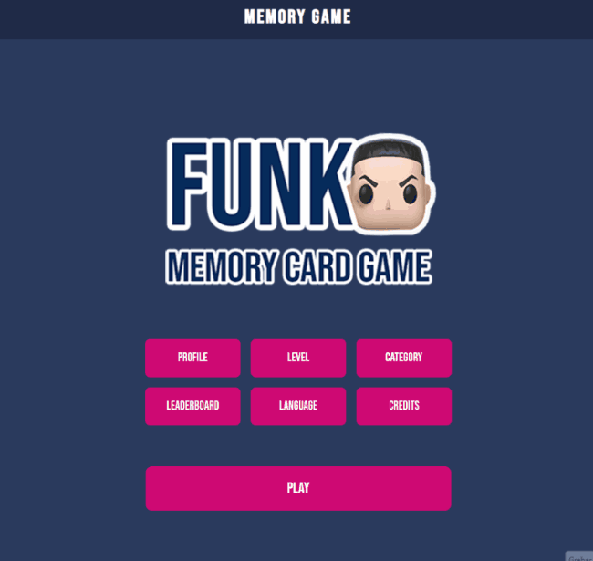
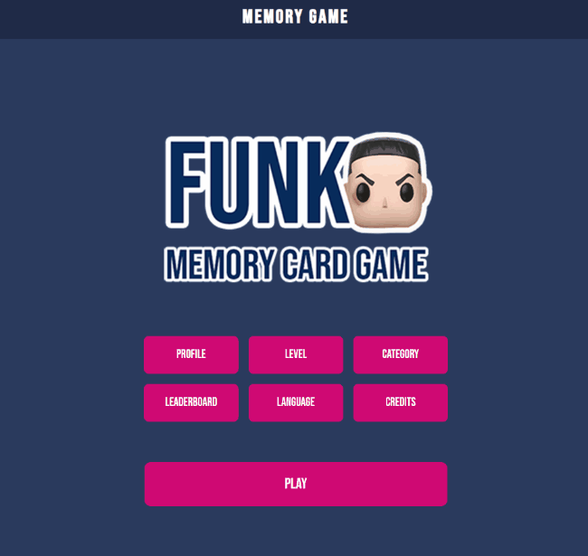

# 🧠 Memory Game – React

Interactive memory card game built with React and Firebase, featuring authentication, difficulty levels, multilingual support, score tracking, and a persistent leaderboard system.

---

## 🚀 Live Demo

👉 https://memory-game-react-cyan.vercel.app/

---

## ⚛️ Project Overview

This project recreates the classic memory card game using React and Firebase.

Players can choose different difficulty levels and categories while competing for high scores stored in Firebase. The application also includes authentication, multilingual support, sound effects, animations, and persistent score tracking.

---

## 🎮 Core Features

### 🧩 Gameplay System

* Card matching and flip logic
* Visual feedback when cards are flipped or matched
* Win detection and automatic game reset

## 🎮 Game Setup Preview




## 🎮Gameplay & Animations




### 🎯 Difficulty Levels

* Easy, Medium, and Hard modes
* Different number of card pairs per level

### 🗂 Categories

* Multiple themes (movies, heroes, musicians, videogames)
* Images loaded dynamically based on the selected category

### 🌐 Multi-language Support

* Supports 3 languages
* Interface text updates instantly when changing languages

---

## 🔐 Authentication & Score System

* User login with Firebase Authentication
* Score calculation based on player performance
* Shared leaderboard across all users
* User scores stored in Firebase Firestore

---

## 🔊 Audio & Animations

### Sound Effects

* Card flip sounds
* Match success feedback
* Button click sounds
* Victory sound effects

### Animations

* UI transitions using GSAP
* Interactive visual feedback during gameplay

---

## 🧠 React Concepts Used

* State management for cards, turns, and matches
* Conditional rendering based on game state
* Component-based structure
* Event handling for user interactions
* Dynamic rendering of cards and categories

---

## 🛠 Tech Stack

* **Frontend:** React
* **Animations:** GSAP
* **State Management:** React Hooks
* **Backend / DB:** Firebase (Firestore)
* **Authentication:** Firebase Auth
* **Styling:** CSS3

---

## 🧠 Challenges & Solutions

### Game State Management

Managing card selection, match detection, and win conditions required careful state handling.

### Solution

* Used React hooks to manage game state
* Prevented invalid actions like flipping more than two cards at the same time

---

### Dynamic Game Configuration

Supporting multiple difficulty levels and categories required reusable game generation logic.

### Solution

* Created reusable functions to generate card sets dynamically
* Adjusted the number of card pairs based on the selected difficulty

---

### Data Persistence

Player scores needed to remain available between sessions.

### Solution

* Stored scores in Firebase Firestore
* Linked scores to authenticated users

---

### User Experience Enhancements

Added sound effects and animations to make gameplay feel more interactive and responsive.

### Solution

* Used GSAP for UI animations and transitions
* Triggered audio feedback based on player actions

---

### 🔊 Browser Audio Autoplay Restrictions

Modern browsers block audio from playing automatically until the user interacts with the page. This prevented the game's background music from starting when the app loaded.

### Solution

* Added an intro overlay (`audioUnlockOverlay`) that waits for a user click or tap before starting audio
* Used the interaction to unlock browser audio playback safely
* Added GSAP transitions to fade into the main menu smoothly
* Used GSAP audio fading to lower the menu music volume during screen transitions

---

## ⚙️ Installation

```bash
git clone https://github.com/walterfcr/MemoryGame-react.git
cd MemoryGame-react
npm install
npm run dev
```

---

## 🚀 Future Improvements

* User profiles with statistics
* Timer-based challenges

---

## 👨‍💻 Author

Walter Fallas Barrantes

---

## 📄 License

This project is for educational and portfolio purposes.
